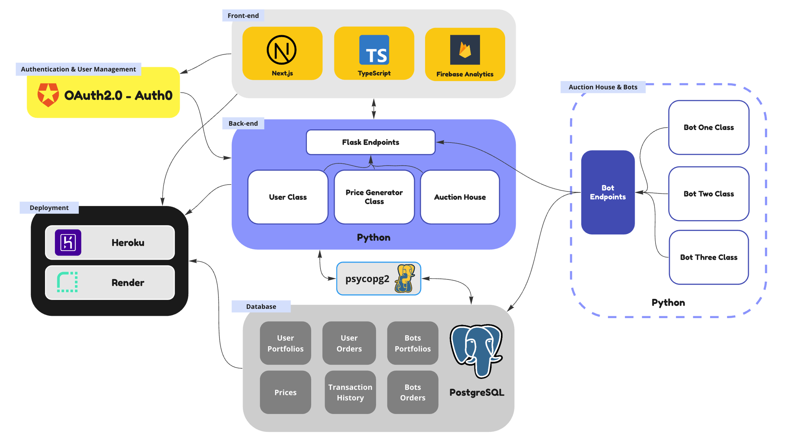
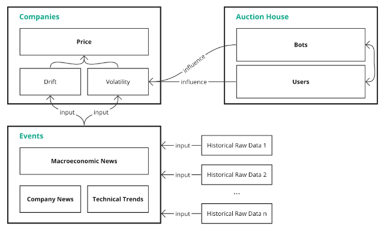

# Aspect - Gamified Finance Trading Platform

## Introduction and Overview

The Aspect trading game is scenario- and event-driven, offering users a platform to explore and solidify finance knowledge, develop niche-specific trading strategies that suit them, and help them optimally capitalize on market opportunities while managing risks.

Unlike existing market simulators, Aspect's stock market is virtual and independent of the current real-world stock market. The Aspect stock market features intense events, allowing users to experience trading during special market events, such as major stock crashes or booms, within a matter of weeks.

The website offers 100+ comprehensive articles on financial concepts and terminology, divided into seven sections: Accounting, Valuation, Trading, Portfolio Management, Decentralized Finance, Environmental, Social, and Governance, and Others. The terminology is vital to the game, and users will be regularly reminded of the terms. Learning this terminology prepares users to conduct financial analyses independently and apply the models to assist in real-world stock market trading.

## Software Application Framework


The Aspect virtual economic ecosystem is composed of five key elements:
1. Front-end interactions built with React, Next.js, Firebase, and Sanity, with high performance and server-side rendering.
2. Back-end API built with Flask in Python. The endpoints facilitate data communication between the front end, the back-end models (price simulator and auction house), and database.
3. Original Aspect Price Simulation Model based on stochastic differential equations. The model outputs event-driven prices for the virtual companies and market indices. All prices are associated with two or more macroeconomic and company-related events.
4. Auction House that augments user interactions in the game. Users can ask or bid strategically to maximize their profit and influence market movement.
5. Artificial intelligence bots that facilitate the Auction House, making real-time evaluations on pending user orders while preventing improper transactions.

## Front-End Interactions
The front end of Aspect is a server-side rendering application built with Next.js and Typescript and hosted on Heroku. The explainers on terminology and events are connected with the application by Sanity, a platform that hosts blog articles. The front-end application communicates data with the back-end Flask REST API using Axios HTTP request. All of the user interface (UI) and user experience (UX) designs were made after conducting specific market research and prototyping. Firebase computes analytical data, providing feedback on new features and pages. View demonstrations of Aspect’s major web pages and features on Page 9.

Code for front-end interactions are stored here: https://github.com/Avril-Cui/aspect-new-database/tree/main/client 

## Back-End API and Database
The back-end API of Aspect facilitates the front end’s communications with back-end functions and databases. The REST API is built with Flask in Python, with multiple endpoints that manage the following actions:
1.	Users, including login and signup requests.
2.	Price, including requests about current and historical prices to display the numbers and graphs in the front end.
3.	Auction House, including functions handling users’ and bots’ requests to trade on the current price, ask or bid, and accept orders.
The database is built with PostgreSQL and hosted on Heroku. It contains tables storing price data, all users’ portfolios, active users’ orders, all bots’ portfolios, and active bots’ orders. Back-end Flask API requests and sends data to the database through psycopg2.


## Back-End Model
Aspect’s back-end model comprises two parts: the Price Simulation Model and the Auction House, working together to establish an authentic economic ecosystem:



## Price Simulation Model
To teach users how to manage market opportunities and risks during exceptional events, Aspect has an original Price Simulation Model to control market movements. This model ensures that the general price flow follows the events while giving users some influence on the equilibrium price (as further explained in the Auction House section). If no transactions occur at a given time, the next-tick equilibrium price will follow the Price Simulation Model's output. 

The model generates groups of stock prices for virtual companies that adhere to fundamental financial patterns that reflect reality. It is based on the Ornstein–Uhlenbeck process and Geometric Brownian motion, categorizing factors that could affect stock prices into event-driven (drift and mean) and unknown (volatility) factors. Both factors are variables that change frequently. The model assumes that all price changes are normally distributed. 

Aspect’s Price Simulation Model first filters random noise (volatile fluctuations) using a moving-average algorithm. Then, regarding the abstraction of stock prices as different waves, these smoothed prices' amplitude, period, and frequency can be modified based on each gaming season's storylines. For instance, to simulate a company experiencing an IPO while the entire market faces a significant recession, the model inputs two historical prices (for example, during Facebook's IPO and the 2008 Great Recession). After filtering the noise, the weighted sum (i.e., 0.4 for the company event and 0.6 for the market event) for the two price waves is calculated. This operation is based on the assumption that an individual company's price trend is correlated to the stock market's condition. This process results in a new wave containing real-world historical events' characteristics.

Effect visualization:


## Noise-filtering algorithm:
```
def helper_filter_noise(start_date, end_date, symbol, window):
    historical_price = pdr.get_data_yahoo(symbol, start_date, end_date)['Adj Close']
    smooth_wave = historical _price.rolling(window=window).mean()[window:].to_list()
    return smooth_wave
```

Afterwards, another function calculates the drift (θ), mean (μ), and volatility (σ) for the Ornstein–Uhlenbeck process:
$$\Delta P_t = \theta_t (P_t-\mu_t) \Delta t + \sigma_t dB_t$$

The drift ($\theta$) and mean ($\mu$) are calculated based on the new smooth wave while the volatility is calculated based on the historical prices.

Parameter calculation:
```
import pandas as pd
from sklearn.linear_model import LinearRegression

def helper_sde_params(file):
    price_df = pd.read_csv(file)
    stock_price = price_df["Adj Close"].tolist()

    #1: re-format the price list, explained in the next part
    sampling_price_list = []
    for index in range(len(stock_price)):
        price_list = []
        if len(stock_price)-index > 10:
            for number in range(10):
                price_list.append(stock_price[index+number])
            sampling_price_list.append(price_list)

    theta_lst = []
    mu_lst = []
    sigma_lst = []

    for index in range(len(sampling_price_list)):
        X_t = np.array(sampling_price_list[index])
        y = np.diff(X_t)
        X = X_t[:-1].reshape(-1, 1)
        reg = LinearRegression(fit_intercept=True)
        reg.fit(X, y)
        theta = -reg.coef_[0]
        mu = reg.intercept_ / theta
        y_hat = reg.predict(X)
        sigma = np.std(y - y_hat)
        theta_lst.append(theta)
        mu_lst.append(mu)
        sigma_lst.append(sigma)

    return (theta_lst, mu_lst, sigma_lst)
```
Then, using the Ornstein-Uhlenbeck formula, the baseline, daily equilibrium price is generated.

Price calculation (this function is looped for all ticks):
```
def ontk_price(last_price, theta, mu, sigma, dt):
        bm = np.random.normal(0,1)
        tmp_bm_coeff = bm * np.sqrt(dt)
        simulated_price = last_price + theta*(last_price-mu)*dt + sigma*tmp_bm_coeff 
        return simulated_price
```

Easily-accessible historical stock prices are day-based, while the Aspect trading game requires second-based prices. To achieve this, events in Aspect happen ten times faster than in the real world. This setup also enables users to experience intense events within weeks. To achieve this feature, the program groups ten daily prices outputted in the last section into one day (this is denoted by #1 in the code for the parameter calculation function). The inner-day price follows the drift (μ_t) of these ten prices and randomly fluctuates (σ_t) around the drift. The second-based inner-day price is derived using Geometric Brown motion:

$$\Delta S_t = \mu_t S_t \Delta t + \sigma_t S_t dB_t$$

Effect visualization:


The Aspect Stock Price Simulator establishes a trading environment for users to test their investment strategies in a market characterized by intense and frequent events, thereby preparing them to handle stock booms and crashes in the real-world market in the future.

Models and algorithms related to the Stock Price Simulator are stored here: https://github.com/Avril-Cui/aspect-code-demo/tree/main/backend/Price .

## Auction House
In the stock market, the equilibrium price is determined by supply and demand at a given time. The latest transaction price becomes the equilibrium price in the next tick (point in time). However, in other existing trading games, players do not influence the market.

An Auction House is built on top of the Price Simulation Model to augment user interactions. In the Auction House, users have three choices:
1.	Trade on the current price.
2.	Place an ask or bid order higher or lower than the current price and wait for the order to be accepted by a bot.
3.	Accept an existing order placed by the bots.

In addition to users, intelligent trading bots programmed with investment strategies continually buy and sell in the market. When a user places an order at a price that is neither the current equilibrium price nor the price engine's output, the order enters a pending state. As part of the Auction House’s rules, users cannot accept each other's pending orders to prevent malicious actions such as cash transfers or cheating. However, they can take orders placed by different bots. The bots in the market will also evaluate and accept users' pending orders.

An order is completed when a user trades at the current price, a user accepts a bot's order, or a bot accepts a user's order. The price of the completed order then becomes the new equilibrium price in the next tick. If no order is completed at a given tick, Bot 2 (see next section) will automatically buy and sell at the next tick price generated by the Price Simulation Model. The flow of the price system is as follows:


Thus, user decisions change company prices, cultivating interaction in the Aspect market game.

All of the functions associated with the Auction House are stored here: https://github.com/Avril-Cui/aspect-code-demo/blob/main/backend/House/auction_house.py .

## Artificial Intelligence Bots
The bots serve to increase diversity and ensure fairness in the game. Each instance of a trading bot employs a unique strategy that either mimics a specific type of investor or implements a statistical learning model for decision-making:

1.	Bot Type One consists of bots that adhere to game-theoretical, decision-making, or technical trading strategies. Most strategies in Bot Type One are simple and straightforward, aiming to represent typical groups of investors in the market.

2.	Bot Type Two frequently buys and sells at the market equilibrium price generated by the Aspect Price Simulator.

3.	Bot Type Three are AI bots with more advanced strategy models, primarily statistical regression or machine learning models. These strategies are more complex than Bot Type One and are commonly employed in high-frequency trading (HFT) and algorithmic trading. These bots aim to experiment with the performance of more complex statistical models in a stock market characterized by exceptional events, such as an economic crisis or a stock boom. In the first season, these bots overall performed better than Bot Type One.

By processing market information, including historical prices, current prices, stock volumes, news, and financial statistics, the bots evaluate the situation based on their individual strategies and decide whether an order should be placed or accepted. 

The bots are collectively hosted on PythonAnywhere as a stand-alone program. They conduct frequent, real-time requests to the Flask REST API to get the newest market information and to make investment decisions.

Examples of Bot 1, Bot 2, Bot 3 classes and the collective request program are stored here: https://github.com/Avril-Cui/aspect-code-demo/tree/main/bots .

## User Interface Walkthrough


